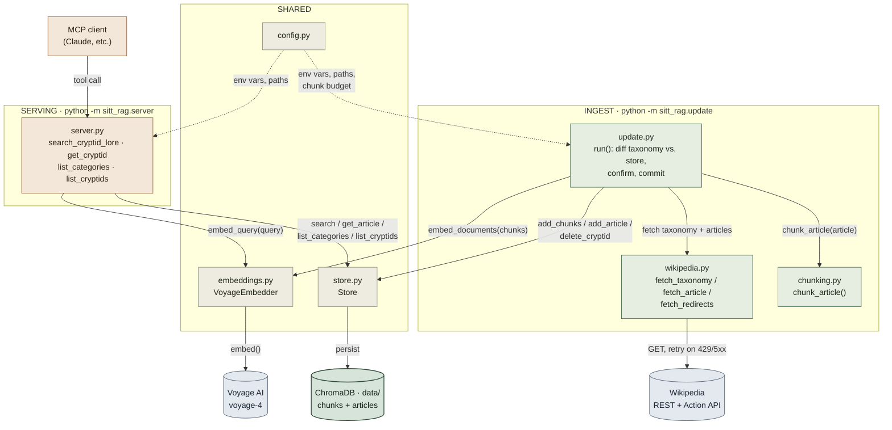

# Component map

A local-first RAG server over Wikipedia's cryptid taxonomy: a batch `update.py`
pipeline fetches, chunks, and embeds articles into ChromaDB, and a separate
`server.py` process exposes that store to MCP clients as four read-only tools.

Two independent entry points share the same storage and embedding code:
`update.py` runs offline to rebuild the corpus, while `server.py` runs
long-lived and only ever reads from it. Dashed arrows are configuration, not
data flow.

## Module reference

### Ingest

- **update.py** — Orchestrates a full diff-and-confirm ingest run: added /
  changed / removed / unchanged / failed buckets, then a `[y/N]` commit.
- **wikipedia.py** — Fetches the taxonomy and article HTML, with
  retry/backoff on transient (429/5xx) errors only.
- **chunking.py** — Splits article sections into token-budgeted chunks with
  one paragraph of overlap, via tiktoken.

### Serving

- **server.py** — MCP server exposing four tools, all returning
  `{"error": {...}}` instead of raising.

### Shared

- **embeddings.py** — Thin Voyage AI client wrapper — `embed_documents` for
  ingest, `embed_query` for search.
- **store.py** — ChromaDB access: `chunks` (embedded, searched) and
  `articles` (full text) collections.
- **config.py** — Env vars, data dir, chunk budget, and the Voyage model
  name — read once at import.

## Stack

python 3.11+ · mcp · chromadb · voyageai · tiktoken · requests + bs4

data/ · chroma.sqlite3 + hnsw index
